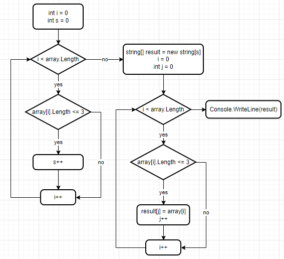

# Итоговая контрольная работа по основному блоку.
*Задача*: Написать программу, которая из имеющегося массива строк формирует новый массив из строк, длина которых меньше, либо равна 3 символам. Первоначальный массив можно ввести с клавиатуры, либо задать на старте выполнения алгоритма. При решении не рекомендуется пользоваться коллекциями, лучше обойтись исключительно массивами.

## 1. Блок-схема алгоритма

## 2. Описание решения
Решение состоит из двух этапов: определение длины результирующего массива, заполнение результирующего массива.

### 2.1. Определение длины результирующего массива.
Чтобы определить длину результирующего массива, нужно, используя цикл, сосчитать количество элементов стартового массива, длина которых не больше 3 символов. Полученное значение использовать для создания результирующего массива.

### 2.2. Заполнение результирующего массива.
Чтобы заполнить результирующий массив, нужно, используя цикл, присваивать текущему элементу результирующего массива значение элемента стартового массива, длина которого не превышает 3. При выполнении каждого такого присвоения, инкрементировать текущий индекс результирующего массива.